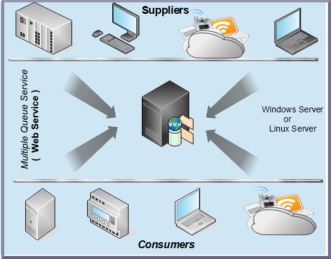
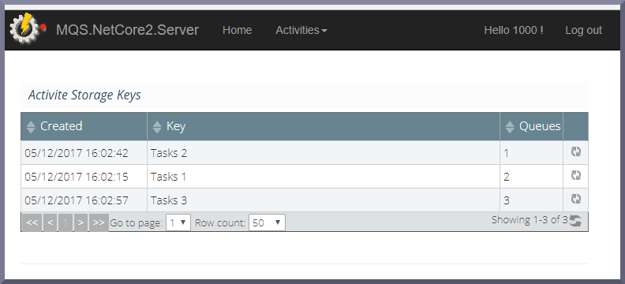

# Multiple-Queue-Service
Multiple Queue Service ( MQS ) with multiple consumers. 

Multiple Queue Service ( MQS ) is a fully managed message queuing service that makes it easy to decouple and scale micro-services, 
distributed systems, and server-less applications.

MQS  is a web service that gives you access to message queues that store messages waiting to be processed.

With MQS, you can quickly build message queuing applications that can run on any multiple consumers and multiply computers.

Simple Web admin options:

   
